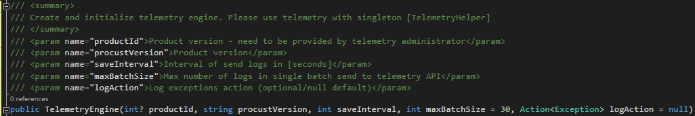
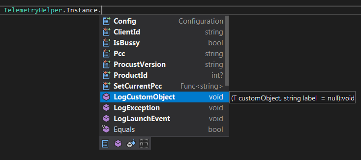

# **Travelport Telemetry API**

With Travelport Telemetry API, you can easily monitor your application for usage, availability and performance. You can also quickly identify and diagnose errors in your application without waiting for a user to report them.

This quickstart guides you through adding the Travelport Telemetry API SDK to an existing ASP.Net applications (like Smartpoint App Plugin/Web App/Desctop App).

# Prerequisites

- .NET 4.6.2
- Visual Studio
- Reference to Newtonsoft.Json up to 6.0.0.0

# Enable Telemetry API

API can gather telemetry data from any internet-connected application, regardless of whether it's running on-premises or in the cloud. Use the following steps to start:

- Take product ID (int) you wish to log your telemetry.
- If your product not exists provision a new product to be added (contact Travelport Product Owner)
- Add SDK dll reference (together with config file) to your project
- Initialize telemetry engine object by creating new Telemetry object

- Start using your telemetry API :)

# Examples:

<B>Log custom object &nbsp;example 1:</B>

TelemetryHelper.Instance.LogCustomObject(new

<H2>{</H2>

&nbsp;&nbsp;&nbsp; Prop1 = &quot;value1&quot;,

&nbsp;&nbsp;&nbsp; Prop2 = 333 //, ...

}, &quot;optional label as data type&quot;);

<B>Log custom object example 2:</B>

TelemetryHelper.Instance.LogCustomObject(new ButtonsConfigClass

{

&nbsp;&nbsp;&nbsp;
Url = &quot;<A href="https://travelportee.visualstudio.com/Telemetry">https://travelportee.visualstudio.com/Telemetry</A>&quot;,

&nbsp;&nbsp;&nbsp;
PersonalButtonsConfigFilePath
= &quot;C:\\config1.xml&quot; //, ....

});

&nbsp;

<B>Log launch event example:</B>

TelemetryHelper.Instance.LogLaunchEvent();

&nbsp;

<B>Log exception message example:</B>

TelemetryHelper.Instance.LogException(&quot;Some self-explanatory error
message :)&quot;);

&nbsp;

&nbsp;

<B>Initialization (add to first line at Plugin.cs):</B>

&nbsp;

var logAction = new Action&lt;Exception&gt;(ex =&gt;

{

&nbsp;&nbsp;&nbsp; //use your logger
here:)

});

&nbsp;

var getCurrentPccFunc = new Func&lt;string&gt;(() =&gt;

{

&nbsp;&nbsp;&nbsp; return UIHelper.Instance.CurrentTEControl.Connection.CommunicationFactory.GetCurrentPcc();

});

&nbsp;

var assemblyPath = new Uri(Assembly.GetExecutingAssembly().CodeBase).LocalPath;

var version = System.Reflection.AssemblyName.GetAssemblyName(assemblyPath).Version;

var telemetry = new TelemetryEngine(1,
version.ToString(), 10, 30, logAction);

CoreHelper.Instance.OnSmartpointClose += (s, o)
=&gt; telemetry.SaveAllAndClose();

TelemetryHelper.Instance.SetCurrentPcc = getCurrentPccFunc;

## **Store telemetry logs API endpoint:** 
https://travelportee.eu/telemetryapi/api/storelogs
(POST of array of telemetry object with schema described below)

## **Telemetry log object schema:**

<PRE style="margin: 10px 0px 0px;font-family: &amp;quot;padding: 10px;white-space: pre-wrap;font-size: 12.6px;line-height: 1.6;color: rgba(0, 0, 0, 0.87);font-style: normal;font-weight: normal;letter-spacing: normal;text-align: start;text-indent: 0px;text-transform: none;word-spacing: 0px;background-color: rgb(255, 255, 255)">  1 {
  2    "$id": "http://example.com/example.json", 
  3    "type": "array", 
  4    "definitions": {}, 
  5    "$schema": "http://json-schema.org/draft-07/schema#", 
  6    "items": {
  7       "$id": "http://example.com/example.json/items", 
  8       "type": "object", 
  9       "properties": {
 10          "ActivityId": {
 11             "$id": "http://example.com/example.json/items/properties/ActivityId", 
 12             "type": "integer", 
 13             "title": "The Activityid Schema ", 
 14             "default": 0, 
 15             "examples": [
 16                1
 17             ]
 18          }, 
 19          "DateAddedUtc": {
 20             "$id": "http://example.com/example.json/items/properties/DateAddedUtc", 
 21             "type": "string", 
 22             "title": "The Dateaddedutc Schema ", 
 23             "default": "", 
 24             "examples": [
 25                "2018-03-01T08:34:25"
 26             ]
 27          }, 
 28          "Version": {
 29             "$id": "http://example.com/example.json/items/properties/Version", 
 30             "type": "string", 
 31             "title": "The Version Schema ", 
 32             "default": "", 
 33             "examples": [
 34                "1.0.0.0"
 35             ]
 36          }, 
 37          "ExceptionMessage": {
 38             "$id": "http://example.com/example.json/items/properties/ExceptionMessage", 
 39             "type": "string", 
 40             "title": "The Exceptionmessage Schema ", 
 41             "default": "", 
 42             "examples": [
 43                "some exception message"
 44             ]
 45          }, 
 46          "ActivityType": {
 47             "$id": "http://example.com/example.json/items/properties/ActivityType", 
 48             "type": "integer", 
 49             "title": "The Activitytype Schema ", 
 50             "default": 0, 
 51             "examples": [
 52                1
 53             ]
 54          }, 
 55          "JsonCustomObject": {
 56             "$id": "http://example.com/example.json/items/properties/JsonCustomObject", 
 57             "type": "string", 
 58             "title": "The Jsoncustomobject Schema ", 
 59             "default": "", 
 60             "examples": [
 61                "{...}"
 62             ]
 63          }, 
 64          "JsonCustomObjectType": {
 65             "$id": "http://example.com/example.json/items/properties/JsonCustomObjectType", 
 66             "type": "string", 
 67             "title": "The Jsoncustomobjecttype Schema ", 
 68             "default": "", 
 69             "examples": [
 70                "SbWarnMsg"
 71             ]
 72          }, 
 73          "Pcc": {
 74             "$id": "http://example.com/example.json/items/properties/Pcc", 
 75             "type": "string", 
 76             "title": "The Pcc Schema ", 
 77             "default": "", 
 78             "examples": [
 79                "YYYY"
 80             ]
 81          }, 
 82          "ClientId": {
 83             "$id": "http://example.com/example.json/items/properties/ClientId", 
 84             "type": "string", 
 85             "title": "The Clientid Schema ", 
 86             "default": "", 
 87             "examples": [
 88                "g1234567"
 89             ]
 90          }, 
 91          "LaunchDate": {
 92             "$id": "http://example.com/example.json/items/properties/LaunchDate", 
 93             "type": "string", 
 94             "title": "The Launchdate Schema ", 
 95             "default": "", 
 96             "examples": [
 97                "2018-03-01T08:34:23"
 98             ]
 99          }, 
100          "ProductRefId": {
101             "$id": "http://example.com/example.json/items/properties/ProductRefId", 
102             "type": "integer", 
103             "title": "The Productrefid Schema ", 
104             "default": 0, 
105             "examples": [
106                1
107             ]
108          }
109       }
110    }
111 }</PRE>
